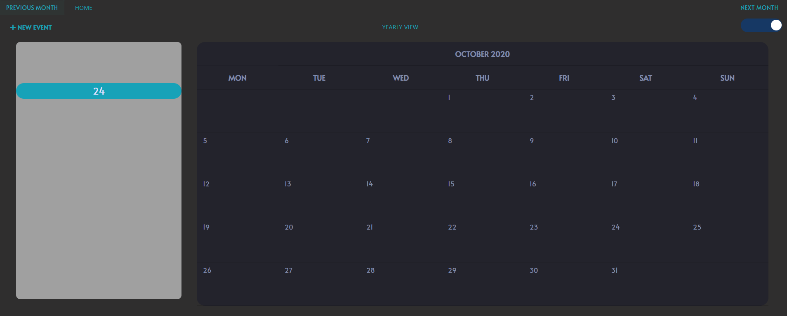

# Django Calendar

This was my first ever project that I created while during my time in Coding Dojo(full-stack software development coding bootcamp).It is an event calendar built based of Django’s HTMLCalendar and class based view. This project was completed in 5 days.

---

---

## Features

### Completion Date: October 2019

- Sidebar of day's events (defaults to today)
- Monthly view of events -> Click on each day to change the sidebar view of the day's events
- CRUD of events in the calendar
- Navigate to the next and previous month
- Yearly view to navigate to the specific month and year inputted
- Light and dark view

## Usage

Clone the repo:

- Run command: `git clone https://github.com/MichelleTanzil/django_calendar.git`
- Run command:`cd django_calendar`

Install python and django

- Download [python](https://www.python.org/downloads/)
- Run command:`pip3 install django`
- Run command:`pip install django-colorfield`

Running the application:

- `python3 manage.py migrate`
- `python3 manage.py runserver`

The application is now running on localhost:8000

## Comments from the dev

Because this is my first ever project, I'm aware of that the code, design, structure etc. was not ideal and there will probably not be any changes to it. However, I believe it shows my potential after only 6 weeks of software development training.

This project is dear to me as this is first project where I wanted to explore how far I can learn and build within 5 days of dedicated time on it.

### Completion Date: October 2019

## Credits

The starting point of the project was taken from:
Huiwenhw - [Django Calendar](https://github.com/huiwenhw/django-calendar)
